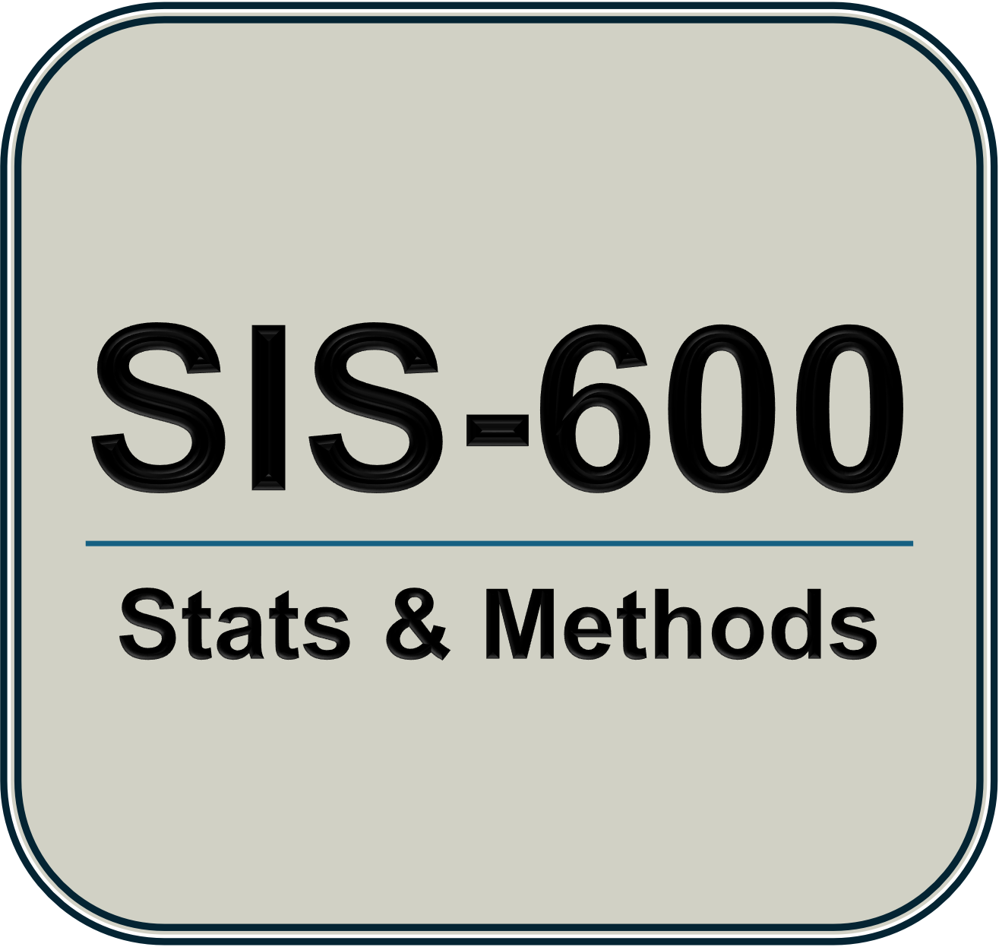

```{r setup, include=FALSE}
  options(htmltools.dir.version = FALSE)
  knitr::opts_chunk$set(
    message = F, 
    warning = F, 
    eval = T, 
    echo = F,
    fig.align = 'center', 
    dev = 'svglite'
  )
  xaringanExtra::use_panelset()
```


class: partial-bg50, middle

.pull-left[
```{r, out.width="70%"}

```
]

.pull-right[
# 02 - Data and measurement

- Measurement scales

- Modes of collecting data

- Computing with R

- *DUE TODAY: SKILLS BUILDER*

]


---
class: inverse

# Why data matters

&nbsp;

> The quality of your findings cannot exceed the quality of your data.

&nbsp;

### Evaluating findings

1. Measurement validity  
2. Internal validity   
3. External validity   


---
# What's in your dataset?

- **Dataset** A structured collection of empirical information. Typically organized as a rectangular file that contains $k$ variables about $n$ units (cases).

- **Variable** Any measurable characteristic of a unit under study. 

- **Score** Possible value of a variable.

- **Units** The cases being observed in a study. Ex: Reading score of elementary students. Reading score is the variable. The students are the units whose scores we measure.  


---
# What type of variable is that?
### Measurement scales

- Quantitative (numeric-valued) or Categorical?

- Nominal, ordinal, or interval?

- Discrete or continuous?


---
# Is that a valid instrument?
### Where good measures go bad

1. Face Validity
  - Extent to which a measure appears to assess what it is supposed to.
  - Does the measure look reasonable and appropriate to experts or participants?

2. Content Validity
  - Degree to which a measure covers the full range of the concept.
  - Does the measure include all important facets of the concept?

3. Construct Validity
  - Extent to which a measure accurately represents the concept it is intended to measure.
  - Is the measure aligned with related constructs and distinct from unrelated ones?


---
# How did you generate your data?
### Modes of collection

- Experiments: randomization and manipulation.  
  - Pros: maximizes potential internal validity  
  - Concerns: ethics, feasibility.  
- Observational research: Observes and record.  
  - Pros: more available, measures phenomenon in "natural" setting 
  - Concerns: internal validity  

- What about external validity?
  - Function of researcher's intention. What's the aim? 
  - Less dependent on mode of data collection
  
  
---
# How did you select cases for the study?
### Sampling and common problems

- Virtue of random sampling  
  - Random sample: units selected from sample frame with known probability.  
  - Sample is representative of population

- Concerns about samples    
  - Non-probability sample: unrepresentative
  - Random sampling error: sample stats differ because samples differ
  - Non-response bias: Missing data typically not missing at random  


---
# Overview: Evaluating research

.pull-left[
### Concerns    
- Measurement validity  
- Internal validity  
- External validity
]

.pull-right[
### Role of data
- Measurement scales and instrument design  
- Sampling methods  
- Mode of collection (type of study design)  
]
  

---
class: inverse

# Intro to R

### What you need
- R Studio (and R) installed.   
- Create an SIS 600 folder, e.g., in documents.  
- Download the Quality of Government data (standard cross section, `.csv`).  
- Save to your 600 folder.
- Open the codebook.  


---
# A first session

.pull-left[ 
1. Open R Studio. Look around.

2. Create a new script file. 
  - Load packages.  
  - Set directory.  
  - Open QoG data.  
  - Analyze something!

3. Save script, and quit.

]

.pull-right[
```{r, eval = F, echo = T}
# Austin H
# R first session

# Packages and directory
  library(tidyverse)
  setwd("~/Documents/SIS 600/")
  
# Open .csv data
  df <- read_csv("qog_std_cs_jan24.csv")
  
# Analyze data on one variable!
  summary(df$wdi_wip)
```
]


---
# Now you try

> I want to study wealth disparities across nations. I'm using the QoG dataset. I select `wdi_gdpcapgr` as my measure.

1. Describe the data set. 

2. What kind of measure is `wdi_gdpcapgr`?

3. Open the data in R Studio

4. Summarize the data on the variable.  

5. Evaluate the variable as a measure of development.


---
class: partial-bg50, middle, center

.pull-right[

# Contact Me

<a href="mailto:ahart@american.edu">
`r fontawesome::fa("paper-plane")` ahart@american.edu
</a>

<a href="https://austin-hart.netlify.app">
`r fontawesome::fa("house-chimney-user")` austin-hart.netlify.app
</a>


<a href="https://github.com/austin-hart-pols">
`r fontawesome::fa("github")` @austin-hart-pols
</a>

<br><br><br>

]